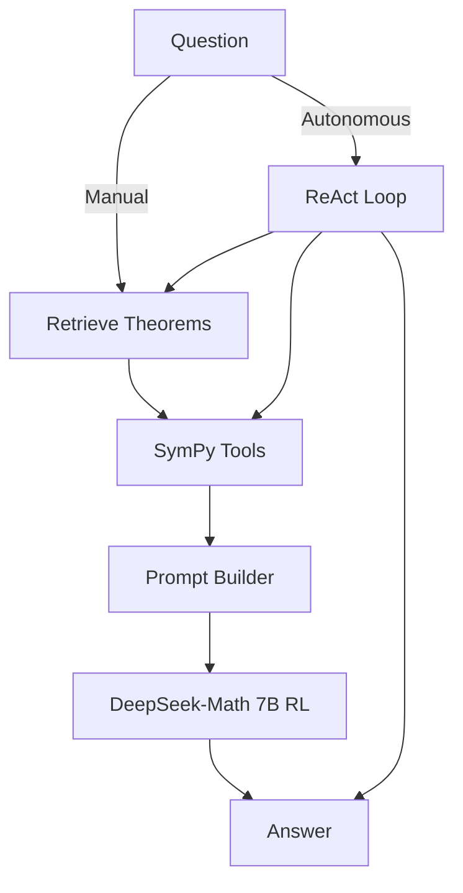
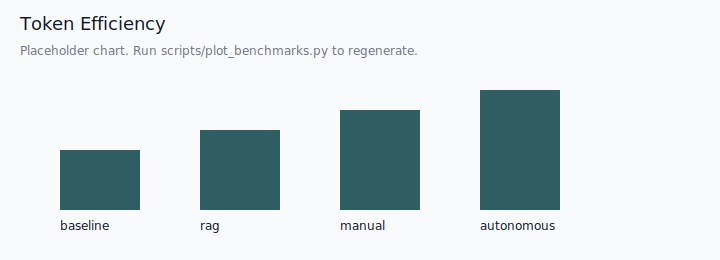

# LLMath

Autonomous ReAct-style theorem-aware math assistant with retrieval and SymPy tools.


> This repository was created in January 2026. The codebase represents work
> completed during the Fall 2025 semester (August-October 2025) for CSE 434 at
> Miami University, subsequently refactored from a Jupyter notebook into a
> production-quality Python package.

## Overview

LLMath is a mathematical proof assistant that combines:

1. **Retrieval-Augmented Generation (RAG)** - Retrieves theorems and definitions from NaturalProofs
2. **Symbolic Tool Use** - Uses SymPy for differentiation, integration, solving, and simplification
3. **Autonomous ReAct Agent** - The model decides when to retrieve or call tools
4. **Fine-tuned LLM** - DeepSeek-Math 7B RL with LoRA adapters for proof-style answers

## ReAct Protocol

LLMath uses a strict XML-style token protocol:

```
<think>reasoning</think>
<tool>tool_name: args</tool>
<observe>result</observe>
<answer>final answer</answer>
```

Details: `docs/react-protocol.md`

## Quick Start

```bash
# 1) Install dependencies
pip install -e ".[dev]"

# 2) Build the FAISS index (first-time setup)
python scripts/build_index.py --rebuild

# 3) Launch the demo
python scripts/run_demo.py
```

## Python API

```python
from llmath.retrieval import NaturalProofsRetriever
from llmath.agent import create_agent

retriever = NaturalProofsRetriever()

# Manual mode (user-provided tools)
manual_agent = create_agent(retriever, mode="manual")
manual_result = manual_agent.run(
    question="Prove that the derivative of x**2*sin(x) is 2*x*sin(x) + x**2*cos(x).",
    sympy_expressions=["diff: x**2*sin(x)"],
)

# Autonomous ReAct mode
react_agent = create_agent(retriever, mode="autonomous")
react_result = react_agent.run(
    "Show that if f is differentiable then f is continuous."
)
```

## Features

- **Autonomous Mode**: ReAct loop decides retrieval/tool calls per step
- **Manual Mode**: Backward-compatible MathAgent with user-provided tool calls
- **TheoremQA Benchmarking**: Baseline vs RAG vs Manual vs Autonomous modes
- **Gradio Demo**: Reasoning trace, tool logs, retrieved theorems, exports

## Architecture



More details: `ARCHITECTURE.md`

## Docs

- `ARCHITECTURE.md`
- `docs/react-protocol.md`
- `docs/benchmarks.md`
- `MODEL_CARD.md`
- `CONTRIBUTING.md`
- `docs/release.md`

## Benchmarking

Run the benchmark:

```bash
python scripts/run_benchmark.py   --dataset theoremqa   --modes baseline,rag,manual,autonomous   --output benchmarks/results.json
```

Generate charts:

```bash
python scripts/plot_benchmarks.py   --input benchmarks/results.json   --output-dir benchmarks/charts
```

### Results (placeholder)

| Mode | Accuracy | Token Efficiency | Notes |
| --- | --- | --- | --- |
| Baseline | TBD | TBD | No tools |
| RAG | TBD | TBD | Retrieval only |
| Manual | TBD | TBD | User-specified tools |
| Autonomous | TBD | TBD | ReAct loop |




## Training

SFT training:

```bash
python scripts/train_lora.py --mode sft --epochs 4 --output-dir outputs/sft-lora
```

ReAct training:

```bash
python scripts/train_lora.py --mode react --epochs 4 --output-dir outputs/react-lora
```

## Development

```bash
pip install -e ".[dev]"
ruff check .
ruff format .
mypy src/llmath
pytest
```

## Project Structure

```
LLMath/
├── src/llmath/
│   ├── agent/        # Manual + ReAct agents
│   ├── retrieval/    # FAISS retrieval + theorem KB
│   ├── tools/        # SymPy tools + registry
│   ├── prompts/      # Prompt templates + builders
│   ├── training/     # SFT + ReAct data + trainer
│   ├── evaluation/   # Baselines + TheoremQA tools
│   └── api/          # Gradio demo
├── scripts/          # CLI entry points
├── benchmarks/       # Results + charts
├── docs/             # Protocol + benchmark docs
└── README.md
```

## License

MIT License - see `LICENSE` for details.

## Authors

- Shree Chaturvedi (chaturs@miamioh.edu)

## Acknowledgments

- [NaturalProofs](https://github.com/wellecks/naturalproofs) dataset
- [DeepSeek-Math](https://github.com/deepseek-ai/DeepSeek-Math) model
- Miami University CSE 434: Introduction to Machine Learning
